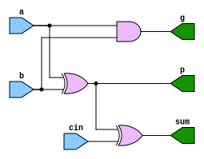
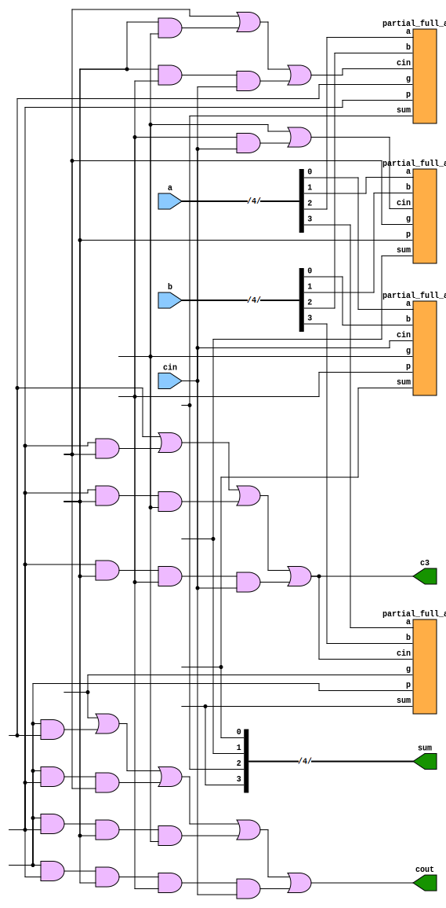
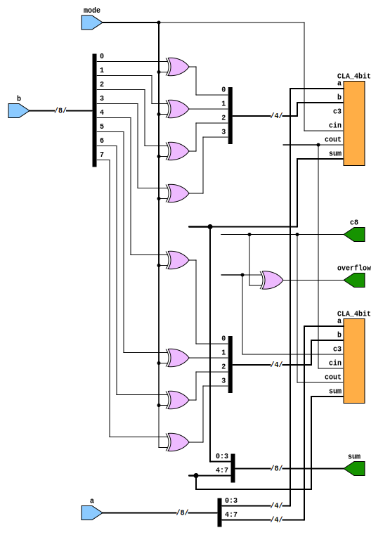
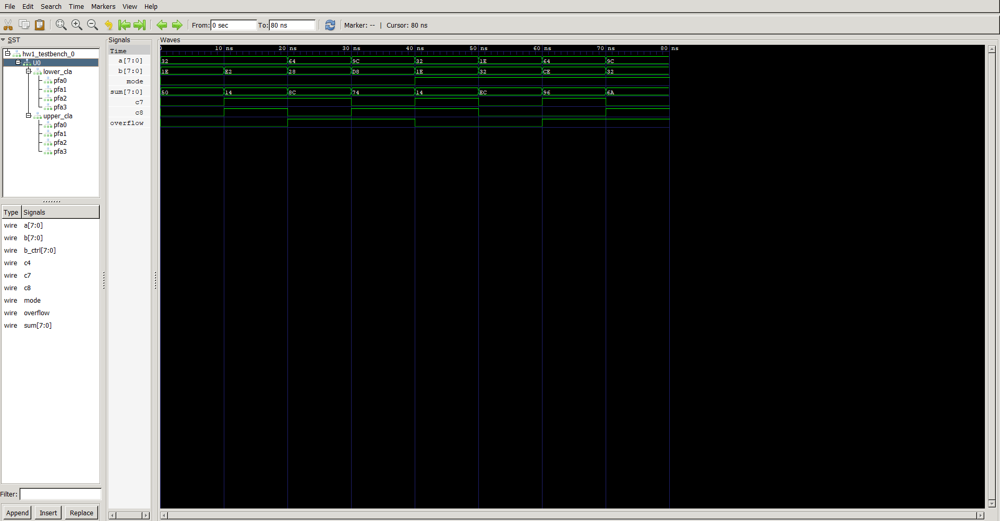
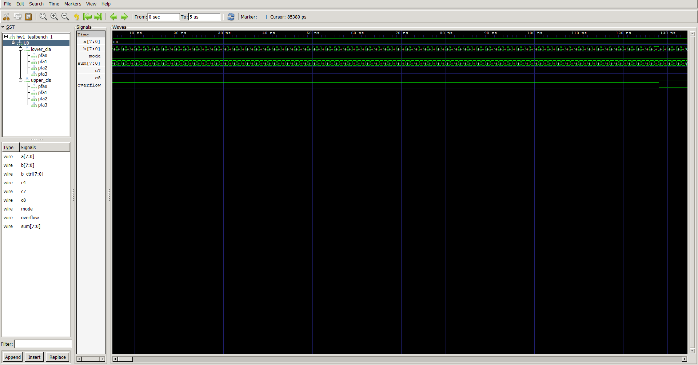

# HW1: 8-Bit Carry Lookahead Adder/Subtractor Report
### 1. Block Diagrams for Each Module
Diagrams are generated by AI and VSCode extension.

The 8-Bit Carry Lookahead Adder/Subtractor architecture is composed of a three-level structural hierachy: 

1-bit Partial Full Adders (PFA), 4-bit Carry Lookahead Adder blocks (`cla_4bit`), and the top-level 8-bit Add/Sub system (`CLA_AddSub_8bit`)

#### 1.1 Partial Full Adder Block Diagram (`partial_full_adder`)
Each bit slice calculates the intermediate bitwise Propogate ($p_i$), Generate ($g_i$), and Sum (s_i) signals.
```
                  +--------------------------------+
     a_i -------->|                                |-----> p_i (Prop = a_i ^ b_i)
     b_i -------->|      partial_full_adder        |-----> g_i (Gen  = a_i & b_i)
                  |                                |
     cin -------->|                                |-----> sum (Sum = p_i ^ cin)
                  +--------------------------------+

```


<div style="page-break-after: always;"></div>

#### 1.2 4-Bit CLA Block Diagram (`cla_4bit`)
Combines four 1-bit PFAs with a parallel two level `AND`-`OR` Carry Lookahead Generator. Internal carry $c_3$ is explicitly exposed to support top-level signed overflow evaluation.
```
                       +----------------------------------------+
   a[3:0] ------------>|                                        |
   b[3:0] ------------>|               cla_4bit                 |-----> sum[3:0]
      cin ------------>|                                        |-----> cout (c4)
                       |   [PFAs + Parallel Carry Generator]    |-----> c3
                       +----------------------------------------+       (Internal Carry)

```



<div style="page-break-after: always;"></div>

#### 1.3 Top-Level 8-Bit CLA Add/Sub System Diagram (`CLA_AddSub_8bit`)
Integrates mode-controlled 2's complement logic (`XOR` array), cascades 4-bit CLA units, and signed overflow detection logic.
```
             +-------------------------------------------------------------------+
             |                       CLA_AddSub_8bit                             |
             |                                                                   |
   a[7:0] ---+----------+--------------------+                                   |
             |          |                    |                                   |
   b[7:0] ---+--->[XOR Gate Array]           |                                   |
             |          | b_ctrl[3:0]        | b_ctrl[7:4]                       |
   mode -----+---+------+--------------------+------+---------------------+      |
             |   |      |                    |      |                     |      |
             |   |  +---+--------------------+---+  |                     |      |
             |   |  |        lower_cla           |  |      upper_cla      |      |
             |   |  |        (cla_4bit)          |  |      (cla_4bit)     |      |
             |   +->| cin                cout  --+->| cin     cout +---+------> c8
             |      | sum[3:0]          c3(NC)   |  | sum[3:0]  c3 +---+  |      |
             |      +----+-----------------------+  +----+---------+---+--|      |
             |           |                               |         |   |  |      |
             |           v                               v         v   v  v      |
             |        s[3:0]                           s[7:4]     [XOR Gate]     |
             |                                                         |         |
             +---------------------------------------------------------+---------+
                                                                       v
                                                                    overflow

```



<div style="page-break-after: always;"></div>

### 2. Implementation Strategy for Each Module
#### 2.1 `partial_full_adder` Module
- **Purpose:** Serves as the fundamental 1-bit arithmetic primitive for the CLA hierachy.
- **Strategy:** Modeled strictly using gate-level primitives (`xor`, `and`) rather than high-level behavioral operaters (`+`)
  - $p_i = a_i \oplus b_i$ (Bitwise Propagate)
  - $g_i = a_i \cdot b_i$ (Bitwise Generate)
  - $s_i = p_i \oplus c_i$ (Stage Sum)

#### 2.2 `cla_4bit` Module
- **Purpose:** Performs high speed 4-bit addition by pre-computing carries in parallel rather than rippling them sequentially.
- **Strategy:** 
  1. Instantiates four `partial_full_adder` primitives to process input bit slices $[3:0]$.
  2. Implements a explicit two-level gate-level Carry Generater using `and` and `or` primitives based on the standard CLA lookahead equations:
       - $C_1 = G_0 + P_0⋅C_{in}$
       - $C_2 = G_1 + P_1⋅G_0 + P_1⋅P_0⋅C_{in}$
       - $C_3 = G_2 + P_2⋅G_1 + P_2⋅P_1⋅G_0 + P_2⋅P_1⋅P_0⋅C_{in}$
       - $C_4 \space (C_{out}) = G_3 + P_3⋅G_2 + P_3⋅P_2⋅G_1 + P_3⋅P_2⋅P_1⋅G_0 + P_3⋅P_2⋅P_1⋅P_0⋅C_{in}$
  3. Exposes the internal carry bit $c_3$ (the carry fed into the MSB $PF$ $A_3$) alongside the primary block carry output $c_out$ ($c_4$).

#### 2.3 `CLA_AddSub_8bit` Module
- **Purpose:** Integrates subtraction capabilities, cascades two 4-bit CLA blocks into an 8-bit adder, and calculates signed 2's complement overflow.
- **Strategy:** 
  1. **Operand Transformation:** Uses eight bitwise `XOR` gates ($b\_ctrl_i = b_i \oplus mode$) to conditionalize input $B$.
  2. **Block Cascading:** Instantiates two `cla_4bit` modules:
     - `lower_cla`: Handles LSBs ($a[3:0]$, $b\_{ctrl}[3:0]$) with $c_{in} = mode$. Produces lower sum bits $sum[3:0]$ and block carry $c_4$.
     - `upper_cla`: Handles MSBs ($a[7:4]$, $b\_{ctrl}[7:4]$) with $c_{in} = c_4$. Produces upper sum bits $sum[7:4]$, final carry $c_8$, and exposes bit 7 carry input $c_7$.
  3. **Overflow Calculation:** Computes signed overflow via a single `XOR` gate taking $c_7$ and $c_8$ as inputs.

<div style="page-break-after: always;"></div>

### 3. Carry-Lookahead Theory and Justification
#### 3.1 Theory
In a standard Ripple Carry Adder (RCA), the carry signal $c_i$ must sequentially ripple through every full adder stage. For an $N$-bit adder, the critical path propagation delay scales linearly with bit width $O(N)$.

Carry Lookahead Adders eliminate this sequential bottleneck by computing all carries concurrently using two fundamental logic functions:
- **Generate ($g_i$):** $g_i = a_i \cdot b_i$ — Stage $i$ generates a carry unconditionally.
- **Propagate ($p_i$):** $p_i = a_i \oplus b_i$ — Stage $i$ propagates an incoming carry $c_i$.

The general recursive carry formula is:
$$c_{i+1} = g_i + p_i \cdot c_i$$

Unrolling this recurrence for a 4-bit block yields two-level AND-OR Boolean equations:
$$c_1 = g_0 + p_0 c_{in}$$

$$c_2 = g_1 + p_1 g_0 + p_1 p_0 c_{in}$$

$$c_3 = g_2 + p_2 g_1 + p_2 p_1 g_0 + p_2 p_1 p_0 c_{in}$$

$$c_4 = g_3 + p_3 g_2 + p_3 p_2 g_1 + p_3 p_2 p_1 g_0 + p_3 p_2 p_1 p_0 c_{in}$$


#### 3.2 Justification
- **Constant Propagation Delay:** Because all carry terms $c_1$ through $c_4$ depend only on the primary inputs ($a_i, b_i, c_{in}$) through at most two gate levels (AND-OR plane), the worst-case carry computation delay is reduced from $O(N)$ to $O(1)$ within each 4-bit block.
- **Performance Impact:** For modern ALU designs, CLA drastically accelerates addition and subtraction operations by decoupling carry generation from intermediate sum calculations.

<div style="page-break-after: always;"></div>

### 4. How Subtraction is Performed
Subtraction is converted into 2's complement addition using the control input $mode$:

$$A - B = A + (-B) = A + (\sim B + 1)$$

#### 4.1 Implemetation Mechanism
1. **1's Complement Transformation (Inversion):** The $B$ bus is fed into an `XOR` gate array controlled by $mode$

    $$b\_ctrl_i = b_i \oplus mode$$
   
   - When $mode = 0$ (Addition): $b\_ctrl_i = b_i \oplus 0 = b_i$ (Unchanged).
   - When $mode = 1$ (Subtraction): $b\_ctrl_i = b_i \oplus 1 = \sim b_i$ (Bitwise Bit-Inversion).

2. 2's Complement Addition ($+1$ via Initial Carry): The initial carry input $c_{in}$ of the `lower_cla` block is tied directly the $mode$:
   - When $mode = 0$: $c_{in} = 0$. The overall equation is $A + B + 0 = A + B$
   - When $mode = 1$: $c_{in} = 1$. The overall equation is $A + \sim B + 1 = A - B$

This unified design accomplishes subtraction with zero addition adder hardware.

### 5. How Signed `overflow` Flag is Derived and Why $c_7$ Has to Be Exposed
#### 5.1 Derivation of Signed Overflow
In signed 2's complement arithmetic, an overflow occurs when an operation produces a result the exceeds the representable range $[-128, +127]$ for 8-bit numbers.

An overflow occurs **if and only if**:
1. Two positive numbers are added, resulting in a negative sum.
2. Two negative numbers are added, resulting in a positive sum.

At the hardware level, signed overflow can be calculated by comparing the carry the carry entering Most Significant Bit (MSB, bit 7) and carry exiting the MSB:

$$Overflow = c_7 \oplus c_8$$

- If $c_7 = 0$ and $c_8 = 1$, or $c_7 = 1$ and $c_8 = 0$, $Overflow = 1$
- If $c_7 = c_8$, $Overflow = 0$

<div style="page-break-after: always;"></div>

### 6. Testbench Strategy
An exhaustive, self-checking Verilog testbench (`hw1_testbench_1`) is developed to verify the design
#### 6.1 Testbench Design Elements
1. **Exhaustive Coverage**: Iterates through every valid input combination:
- $mode \in \{0, 1\}$ (2 operations)
- $A \in [-128, +127]$ (256 values)
- $B \in [-128, +127]$ (256 values)
- Total Test Cases: $2 \times 256 \times 256 = 131,072$ test cases.
2. **Behavioral Golden Model:** Computes expected outputs in parallel using Verilog behavioral additions and signed checks:

```verilog
gold_add = {1'b0, A} + {1'b0, b_ctrl} + mode;
gold_ov  = (A[7] == b_ctrl[7]) && (sum[7] != A[7]);
```

3. **Self-Checking Mechanism:** Compares $s$, $c_8$, and $overflow$ outputs against the Golden Model at every step. Errors are automatically reported to the console with timestamped mismatch logs.
4. **Performance & VCD Optimization:** Restricts **VCD** waveform dumping to the first $5000\text{ ns}$ (`if ($time == 5000) $dumpoff;`) to prevent generating multi-gigabyte files while providing full waveform trace for visual inspection.

### 7. Summary of Simulation Results
#### 7.1 Test Results Summary
- `Total Executed Testcases`: $131,072$ / $131,072$
- `Total Errors Detected`: $0$
- `Verification`: **`PASSED`**

#### 7.2 Key Observation
1. **Signed Overflow Range Bounds:**
   - Adding $100 + 40$ in addition mode ($mode = 0$) produces binary `8'b1000_1100` ($-116$ signed), triggering $overflow = 1$ correctly because $+140 > +127$
   - Subtracting $100 - (-50)$ in subtraction mode ($mode = 1$) yields $-106$ signed, triggering $overflow = 1$ because $+150 > +127$
2. **Cary-Out ($c_8$) Behavior in Subtraction:**
   - In subtraction mode, $c_8 = 1$ indicated that no borrow was required ($A \ge B$), whereas $c_8 = 0$ indicates a borrow occured ($A < B$)

<div style="page-break-after: always;"></div>

### 8. Waveforms (inputs, mode, sum/diff, carry-out, overflow)
The waveform screenshots below illustrate representative simulation testcases generated in GTKWAVE:
| Waveform Sample 1                                  |
| -------------------------------------------------- |
|  |

| Waveform Sample 2                                  |
| -------------------------------------------------- |
|  |
