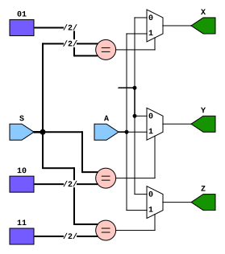
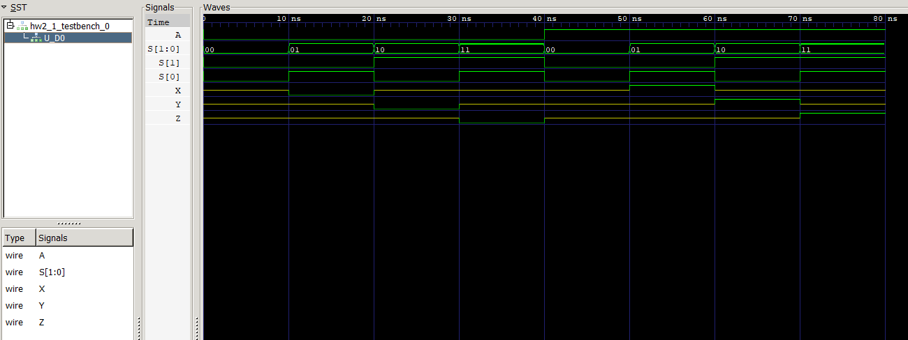
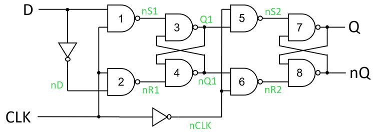
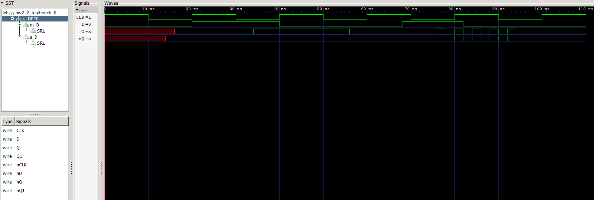
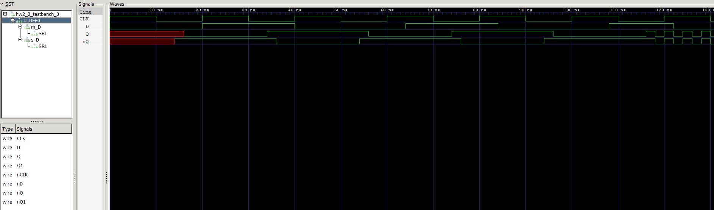
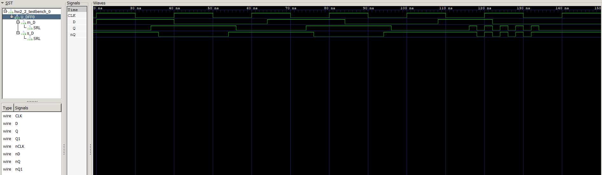

# HW2: Tri-State Demultiplexer, Delay & Setup Time of D-FlipFlop
## Part1: Tri-State Demultiplexer
### 1. Diagram


### 2. Implementation
```verilog
module DEMUX( 
    input  wire       A, 
    input  wire [1:0] S, 
    output wire X, Y, Z
); 

    assign X = (S == 2'b01) ? A : 1'bz;
    assign Y = (S == 2'b10) ? A : 1'bz;
    assign Z = (S == 2'b11) ? A : 1'bz;

endmodule
```

<div style="page-break-after: always;"></div>

#### Explanation here:
If `S` is $01$ then `X` is `A` else `High-Inpedence`.

If `S` is $10$ then `Y` is `A` else `High-Inpedence`.

If `S` is $11$ then `Z` is `A` else `High-Inpedence`.

Else if `S` is $00$ then all `X`, `Y` and `Z` are `High-Inpedence`.

<div style="page-break-after: always;"></div>

### 3. Waveform


<div style="page-break-after: always;"></div>

## Part2: Delay & Setup Time of D-Flip-Flop

### **Questions:**
### Q1: D-Flip-Flop Classification and Justification
The circuit is a **Negative-Edge Triggered D Flip-Flop (Active-Low Clock Triggered)**.

##### 1. **Master-Slave Architecture:**
- The circuit consists of two cascaded SR Latches (or Partial D Latches):
    - **Master Latch:** Formed by NAND Gates 1–4, controlled directly by `CLK`.
    - **Slave Latch:** Formed by NAND Gates 5–8, controlled by `nCLK` (inverted `CLK`).

##### 2. **Behavior during `CLK = 1` (High):**
- The Master Latch is **transparent** (active). Inputs $D$ and $\bar{D}$ propagate through Gates 1 and 2 to update internal nodes $Q_1$ and $nQ_1$.
- `nCLK = 0`, forcing the control inputs of the Slave Latch ($\bar{S_2}$ and $\bar{R_2}$, Gates 5 and 6) to remain fixed at logic `1`. The Slave Latch is in **hold mode** (opaque), maintaining the previous output $(Q, nQ)$.

##### 3. **Behavior during `CLK = 0` (Low)**:
- `CLK = 0` disables Gates 1 and 2 in the Master Latch ($\bar{S_1}=1, \bar{R_1}=1$), locking $Q_1$ and $nQ_1$ in **hold mode**.
- `nCLK = 1` enables Gates 5 and 6 in the Slave Latch, making it **transparent** to transfer the stored state from $(Q_1, nQ_1)$ to the final outputs $(Q, nQ)$.

##### 4. **Trigger Mechanism**:
- Data $D$ is sampled by the Master Latch while `CLK = 1` and is locked at the exact instant `CLK` transitions from $1 \rightarrow 0$ **(falling/negative edge)**. Simultaneously, the inverted clock opens the Slave Latch to pass the locked state to $Q$. Therefore, output state changes are initiated strictly on the **falling edge of `CLK`**.

<div style="page-break-after: always;"></div>

### Q2: Theoretical Derivation of Clock-to-Output Delay ($T_{c2q}$)
**Transport Delay Assumptions**
- `NAND` Gate Delay $(T_g) = 2 \text{ ns}$
- Inverter Delay $(T_{inv}) = 0 \text{ ns}$

**Step-by-Step Derivation**

When `CLK` falls from $1 \rightarrow 0$ at $t = t_{edge}$:

##### 1. **Inverter Propagation:**
- `CLK` $1 \rightarrow 0 \implies$ `nCLK` $0 \rightarrow 1$
- $\Delta t_1 = T_{inv} = 0\text{ ns}$.

##### 2. **Slave Control Gate Propagation (Gates 5 / 6):**
- `nCLK` goes High, enabling Gates 5 and 6. Gate 5/6 evaluates $(Q_1, nCLK)$ and $(nQ_1, nCLK)$ to output control signals $\bar{S_2}$ and $\bar{R_2}$.
- $\Delta t_2 = T_{g} = 2\text{ ns}$.

##### 3. **Case A: $Q$ Rising Edge ($D=1$, initial state $Q=0, nQ=1$):**
- Master holds $Q_1=1, nQ_1=0$. At $t = t_{edge} + 2\text{ ns}$, Gate 5 evaluates $\bar{S_2} = \overline{1 \cdot 1} = 0$, while Gate 6 evaluates $\bar{R_2} = \overline{0 \cdot 1} = 1$.
- **First Transition** ($Q: 0 \rightarrow 1$): Gate 7 receives $\bar{S_2}=0$. Since NAND with $0$ is unconditionally $1$, Gate 7 drives $Q = 1$ at $\Delta t = 2\text{ ns} + 2\text{ ns} = \mathbf{4\text{ ns}}$.
- **Second Transition** ($nQ: 1 \rightarrow 0$): Gate 8 receives updated $Q=1$ alongside $\bar{R_2}=1$, driving $nQ = \overline{1 \cdot 1} = 0$ at $\Delta t = 4\text{ ns} + 2\text{ ns} = \mathbf{6\text{ ns}}$.

##### 4. **Case B: $Q$ Falling Edge ($D=0$, initial state $Q=1, nQ=0$):**
- Master holds $Q_1=0, nQ_1=1$. At $t = t_{edge} + 2\text{ ns}$, Gate 6 evaluates $\bar{R_2} = \overline{1 \cdot 1} = 0$, while Gate 5 evaluates $\bar{S_2} = \overline{0 \cdot 1} = 1$.
- **First Transition** ($nQ: 0 \rightarrow 1$): Gate 8 receives $\bar{R_2}=0$, driving $nQ = 1$ at $\Delta t = 2\text{ ns} + 2\text{ ns} = \mathbf{4\text{ ns}}$.
- **Second Transition** ($Q: 1 \rightarrow 0$): Gate 7 receives updated $nQ=1$ alongside $\bar{S_2}=1$, driving $Q = \overline{1 \cdot 1} = 0$ at $\Delta t = 4\text{ ns} + 2\text{ ns} = \mathbf{6\text{ ns}}$.

**Total Theoretical Clock-to-Output Delay Summary**
- **Primary Output $Q$ Propagation Delay:**
  - $T_{c2q(Q \text{ rising})} = 4\text{ ns}$
  - $T_{c2q(Q \text{ falling})} = 6\text{ ns}$
- **Complete Latch Settlement Delay (Both $Q$ and $nQ$ valid):** $T_{c2q(\text{settled})} = \mathbf{6\text{ ns}}$.

<div style="page-break-after: always;"></div>

### Q3: Verilog Simulation of Clock-to-Output Delay ($T_{c2q}$)
**Simulation Process & Monitored Signals**
- **Monitored Signals:** `CLK`, `D`, `Q`, `nQ`.
- **Detailed Measured Transitions:**
  - **Testcase 1** ($Q: 0 \rightarrow 1$, $D=1$):
    - Falling edge of `CLK` occurs at $t = 30\text{ ns}$.
    - Signal $Q$ transitions from $0 \rightarrow 1$ at $t = 34\text{ ns}$ ($\Delta t = 4\text{ ns}$).
    - Signal $nQ$ transitions from $1 \rightarrow 0$ at $t = 36\text{ ns}$ ($\Delta t = 6\text{ ns}$).
  - **Testcase 2** ($Q: 1 \rightarrow 0$, $D=0$):
    - Falling edge of `CLK` occurs at $t = 50\text{ ns}$.
    - Signal $nQ$ transitions from $0 \rightarrow 1$ at $t = 54\text{ ns}$ ($\Delta t = 4\text{ ns}$).
    - Signal $Q$ transitions from $1 \rightarrow 0$ at $t = 56\text{ ns}$ ($\Delta t = 6\text{ ns}$).

**Comparison & Explanation**
- **Result:** The simulated clock-to-output transitions match the theoretical derivation in Question 2 with 100% precision.
- **Why the $4\text{ ns}$ vs $6\text{ ns}$ Asymmetry Occurs:**
  1. **Direct Driving vs Cross-Coupled Propagation:** In an active-low `NAND` SR latch, pulling a control line ($\bar{S_2}$ or $\bar{R_2}$) to $0$ immediately forces that gate's output to $1$ in $1$ gate delay ($2\text{ ns}$). Thus, whichever output transitions to $1$ updates first at $t_{CLK} + 4\text{ ns}$.
  2. **Sequential Resolution:** The output transitioning to $0$ must wait for the newly generated $1$ to propagate across the cross-coupled feedback loop, requiring an additional gate delay ($2\text{ ns}$), completing at $t_{CLK} + 6\text{ ns}$.

<div style="page-break-after: always;"></div>

### Q4: Theoretical Derivation of Setup Time ($T_{setup}$)
#### **Definition**
Setup time ($T_{setup}$) is the minimum time data signal $D$ must remain stable **before** the active clock edge (CLK $1 \rightarrow 0$) to ensure that the Master Latch stably captures $D$.

#### **Critical Path Derivation in Master Latch**
To store $D$ inside the Master Latch when `CLK = 1`:

1. **Input Inversion:** $D$ passes through g_inv_d to form $\bar{D}$ ($\Delta t_1 = T_{inv} = 0\text{ ns}$).
2. **Master Input Gates (Gates 1 & 2):** $D$ and $\bar{D}$ propagate through Gates 1 and 2 to produce $\bar{S_1}$ and $\bar{R_1}$ ($\Delta t_2 = T_{g} = 2\text{ ns}$).
3. **Master SR Latch First Gate (Gate 3 or 4):** $\bar{S_1}$ or $\bar{R_1}$ drives Gate 3 or Gate 4 to update $Q_1$ or $nQ_1$ ($\Delta t_3 = T_{g} = 2\text{ ns}$).
4. **Master SR Latch Feedback Gate (Gate 4 or 3):** The updated $Q1$ or $nQ1$ feeds back to the complementary gate to stabilize the cross-coupled loop $(Q_1, nQ_1)$ ($\Delta t_4 = T_{g} = 2\text{ ns}$).

#### **Total Theoretical Setup Time**
$$T_{setup(\text{theoretical})} = \Delta t_1 + \Delta t_2 + \Delta t_3 + \Delta t_4 = 0\text{ ns} + 2\text{ ns} + 2\text{ ns} + 2\text{ ns} = \mathbf{6\text{ ns}}$$

<div style="page-break-after: always;"></div>

### Q5: Verilog Simulation of Setup Time & Comparison
#### **Verilog Simulation Process**
To determine the minimum setup time in Verilog simulation (`hw2_2_testbench_0`), the arrival time of input $D$ prior to the falling clock edge (CLK $1 \rightarrow 0$) was systematically varied:
- **Case 1** ($T_{setup} = 10\text{ ns} \ge 6\text{ ns}$): $D$ transitions at $t = 20\text{ ns}$ before CLK falls at $t = 30\text{ ns}$. Output $Q$ updates to $1$ at $t = 34\text{ ns}$ and $nQ$ settles to $0$ at $t = 36\text{ ns}$ **(SUCCESS)**.
- **Case 2** ($T_{setup} = 6\text{ ns}$ - Boundary Test): $D$ transitions at $t = 64\text{ ns}$ before `CLK` falls at $t = 70\text{ ns}$. Internal nodes $Q1/nQ1$ settle exactly as `CLK` drops, allowing $Q$ to capture $1$ cleanly at $t = 74\text{ ns}$ and $nQ$ at $t = 76\text{ ns}$ **(SUCCESS)**.
- **Case 3** ($T_{setup} = 2\text{ ns} < 6\text{ ns}$ - Violation Test): $D$ transitions at $t = 108\text{ ns}$ ($2\text{ ns}$ before `CLK` falls at $t = 110\text{ ns}$). Master latch outputs $Q1/nQ1$ are incomplete/unstable when `CLK` falls, causing severe logic oscillation on $Q$ and $nQ$ **(FAILURE)**.

#### **Comparison & Explanation: Why or Why Not Different to Question 4?**
- **Comparison Result:** The simulated setup time ($\mathbf{6\text{ ns}}$) is **NOT different** from the theoretical derivation ($\mathbf{6\text{ ns}}$) in Question 4.
- **Why the simulated setup time matches the theoretical derivation:**

    1. **Strict Gate Delay Alignment:** The Verilog model uses fixed `#2` transport delays (`nand #2`) and `#0` inverter delays. The critical delay path inside the Master Latch consists of 3 logic levels ($T_{g1} + T_{g3} + T_{g4} = 2 + 2 + 2 = 6\text{ ns}$). The discrete event simulator requires this exact duration for $Q_1$ and $nQ_1$ to reach a resolved logic state before `CLK` drops to $0$.
    2. **Idealized Binary Logic Model:** Verilog simulation evaluates discrete logic levels (`0`, `1`, `x`). When $T_{setup} \ge 6\text{ ns}$, the inputs to the Master SR Latch complete their Boolean evaluation before the clock edge disables Gates 1 and 2, guaranteeing latch lock-in.

<div style="page-break-after: always;"></div>

### **Simulation Result:**





