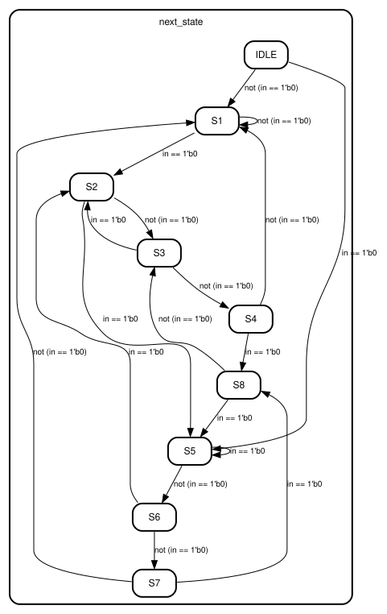
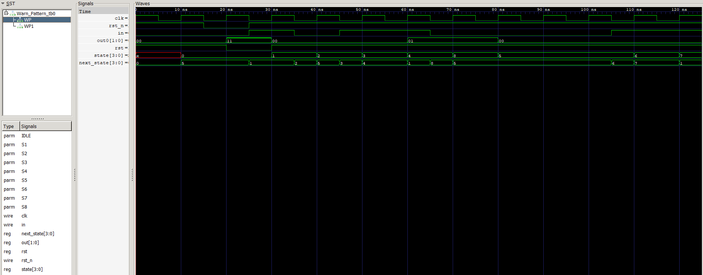
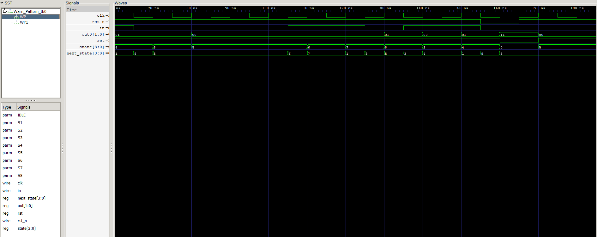

# HW3: Finite State Machines
### 1. State Transition Diagram & the Meaning of the States
#### 1.1 State Diagram

#### 1.2 State Transition Table
<table>
    <tr>
        <td>Current State</td>
        <td>Meaning (Received Pattern)</td>
        <td>Input (in)</td>
        <td>Next Pattern</td>
        <td>Next State</td>
        <td>Output (out)</td>
    </tr>
    <tr>
        <td rowspan=2>S0</td>
        <td rowspan=2>IDLE</td>
        <td>0</td>
        <td>0</td>
        <td>S5</td>
        <td rowspan=2>11</td>
    </tr>
    <tr>
        <td>1</td>
        <td>1</td>
        <td>S1</td>
    </tr>
    <tr>
        <td rowspan=2>S1</td>
        <td rowspan=2>1</td>
        <td>0</td>
        <td>10</td>
        <td>S2</td>
        <td rowspan=2>00</td>
    </tr>
    <tr>
        <td>1</td>
        <td>1</td>
        <td>S1</td>
    </tr>
    <tr>
        <td rowspan=2>S2</td>
        <td rowspan=2>10</td>
        <td>0</td>
        <td>0</td>
        <td>S5</td>
        <td rowspan=2>00</td>
    </tr>
    <tr>
        <td>1</td>
        <td>101</td>
        <td>S3</td>
    </tr>
    <tr>
        <td rowspan=2>S3</td>
        <td rowspan=2>101</td>
        <td>0</td>
        <td>10</td>
        <td>S2</td>
        <td rowspan=2>00</td>
    </tr>
    <tr>
        <td>1</td>
        <td>1011</td>
        <td>S4</td>
    </tr>
    <tr>
        <td rowspan=2>S4</td>
        <td rowspan=2>1011</td>
        <td>0</td>
        <td>0110</td>
        <td>S8</td>
        <td rowspan=2>01</td>
    </tr>
    <tr>
        <td>1</td>
        <td>1</td>
        <td>S1</td>
    </tr>
    <tr>
        <td rowspan=2>S5</td>
        <td rowspan=2>0</td>
        <td>0</td>
        <td>0</td>
        <td>S5</td>
        <td rowspan=2>00</td>
    </tr>
    <tr>
        <td>1</td>
        <td>01</td>
        <td>S6</td>
    </tr>
    <tr>
        <td rowspan=2>S6</td>
        <td rowspan=2>01</td>
        <td>0</td>
        <td>10</td>
        <td>S2</td>
        <td rowspan=2>00</td>
    </tr>
    <tr>
        <td>1</td>
        <td>011</td>
        <td>S7</td>
    </tr>
    <tr>
        <td rowspan=2>S7</td>
        <td rowspan=2>011</td>
        <td>0</td>
        <td>0110</td>
        <td>S8</td>
        <td rowspan=2>00</td>
    </tr>
    <tr>
        <td>1</td>
        <td>1</td>
        <td>S1</td>
    </tr>
    <tr>
        <td rowspan=2>S8</td>
        <td rowspan=2>0110</td>
        <td>0</td>
        <td>0</td>
        <td>S5</td>
        <td rowspan=2>01</td>
    </tr>
    <tr>
        <td>1</td>
        <td>101</td>
        <td>S3</td>
    </tr>
</table>

| Current State | Meaning (Received Pattern) | Input (`in`) | Next Pattern | Next State | Output (`out`)|
| --- | --- | --- | --- | --- | --- |
| $S_0$ | `IDLE` | `0` | $0$ | $S_5$ | **`2'b11`** if `!rst` else `2'b00` |
|       |        | `1` | $1$ | $S_1$ | |
| $S_1$ | $1$    | `0` | $10$ | $S_2$ | `2'b00` |
|       |        | `1` | $1$ | $S_1$ | |
| $S_2$ | $10$   | `0` | $0$ | $S_5$ | `2'b00` |
|       |        | `1` | $101$ | $S_3$ | |
| $S_3$ | $101$  | `0` | $10$ | $S_2$ | `2'b00` |
|       |        | `1` | $1011$ | $S_4$ | |
| $S_4$ | $1011$ | `0` | $0110$ | $S_8$ | **`2'b01`** |
|       |        | `1` | $1$ | $S_1$ | |
| $S_5$ | $0$    | `0` | $0$ | $S_5$ | `2'b00` |
|       |        | `1` | $01$ | $S_6$ | |
| $S_6$ | $01$   | `0` | $10$ | $S_2$ | `2'b00` |
|       |        | `1` | $011$ | $S_7$ | |
| $S_7$ | $011$  | `0` | $0110$ | $S_8$ | `2'b00` |
|       |        | `1` | $1$ | $S_1$ | |
| $S_8$ | $0110$ | `0` | $0$ | $S_5$ | **`2'b01`** |
|       |        | `1` | $101$ | $S_3$ | |

### 2. Explanition of Module Implementation

### 3. Testbench Design & Waveform Screenshots
#### 3.1 Testbench Design

#### 3.2 Waveform Screenshots
| 
Simulation version 0 (0 ~ 125 ns)
 |
| --- |
|  |

| 
Simulation version 0 (60 ~ 185 ns)
 |
| --- |
|  |
